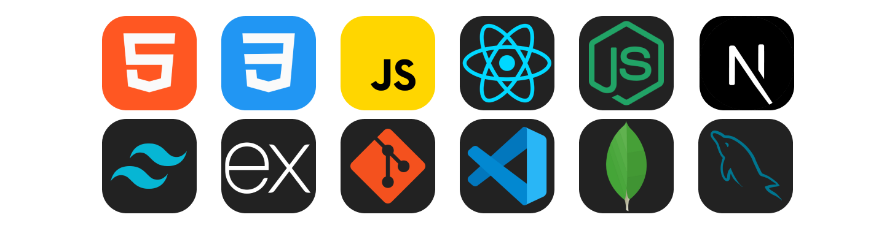

<h1 align="center">Hi 👋, I'm Ankit  Nayak</h1>
<h3 align="center">A Passionate Web Developer From India</h3>

  

<!-- 
  
 -->

-   🌱 I'm Currently Learning: Backend Development

-   💬 Ask me about **HTML,CSS,JavaScript,React,Node**

-   📫 You can reach me @ **ankitnayak882@gmail.com**

<h3 align="left">My Github Trophy Collection : </h3>

<h3 align="left">Languages and Tools: </h3>

<h3 align="left">My Github Stats: </h3>

&nbsp;

